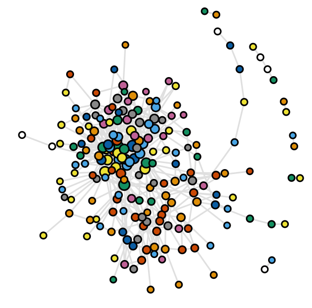
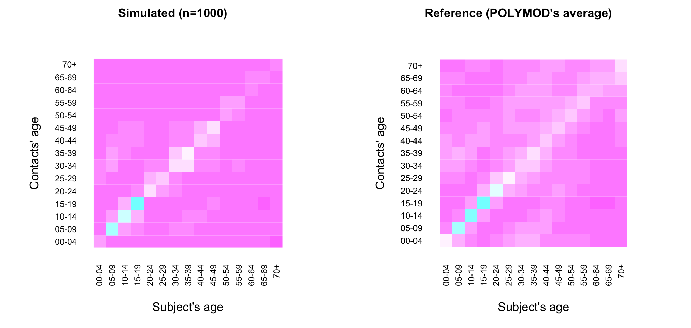

# gennet
Generating network age-specific

# Licencing

<a rel="license" href="http://creativecommons.org/licenses/by-nc-sa/4.0/"></a><br />This work is licensed under a <a rel="license" href="http://creativecommons.org/licenses/by-nc-sa/4.0/">Creative Commons Attribution-NonCommercial-ShareAlike 4.0 International License</a>.

## Requirements

- a target population age-structure
- contact distribution (Mossong et al Plos Medicine)
- contact matrix (Mossong et al Plos Medicine)

```R
N    <- 1000
seed <- 123
```

## Steps

Assign age: depends on the target population age distribution

```R
  SR             <- dget("./data/SR")  # Sierra Leon population
  if (!is.null(seed)) set.seed(seed)
  age           <- sample(SR$age, N, TRUE, SR$prob)
  # add ages 70/80+
  age[age==70] <- sample(70:80, length(age[age==70]), replace=1)
```

Assign #contacts: depends on both target age and POLYMOD data
```R
  agecont      <- orderBy(dget("./data/POLYMODtab1"), 1) # POLYMOD Tab.1
  agecont$rk   <- rank(agecont$age)  # Rank age-group by contact
  POLYMODbreak <- c(0,4,9,14,19,29,39,49,59,69,80) 
  ageGrp <- cut(age, breaks=POLYMODbreak, include.lowest=1)
  ageGrp <- as.numeric(ageGrp) # mapping age to ageGrp
  agerk  <- sapply(ageGrp, function(x) agecont$rk[x==agecont$nmr])
  age    <- rev(orderBy(cbind(age, agerk), 2)[, 1]) # large to small
```

Sampling from contact distribution

```R
  distCont <- dget("./data/distCont")
  ncont    <- sort(sample(distCont$freq, N, 1, distCont$prob), TRUE)
```

Load contact matrix (as probability) POLYMOD data: averaging all countries

```R
  M <- dget("./data/M")  # image(M)
  Mbrk <- c(0,4,9,14,19,24,29,34,39,44,49,54,59,64,69,70)
  Mnmr <- 1:15
  Grp  <- as.numeric(cut(age, breaks=Mbrk, include.lowest=1))
  Grp[is.na(Grp)] <- 15 # 70+ age-grp
```

Run

```R
source("gennet.R")
g <- genNet(N, age)
```

## Outputs

```R
plotNet(g)
```



## Validate

Compare age- and contact-distribution
```R
ks.test(age, vertex_attr(g, "age"))

Two-sample Kolmogorov-Smirnov test

data:  age and vertex_attr(g, "age")
D = 0, p-value = 1

ks.test(degree(g), ncont)

Two-sample Kolmogorov-Smirnov test

data:  degree(g) and ncont
D = 0, p-value = 1

put(1,2)
qqplot(degree(g), ncont, main="QQ Plot", ylab="Target contact distribution")
qqplot(age, vertex_attr(g, "age"), main="QQ Plot", ylab="Target age distribution")
```


Compare contact-matrix

